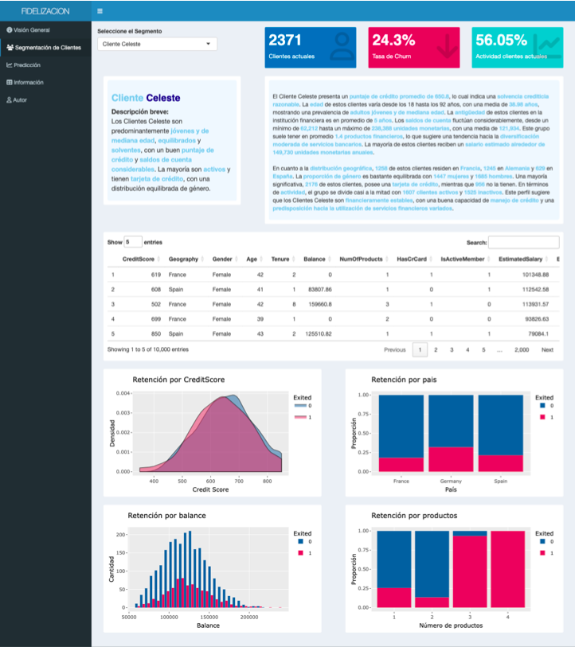
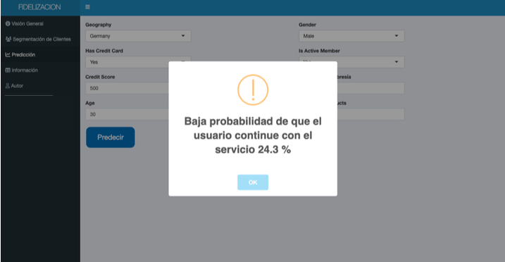
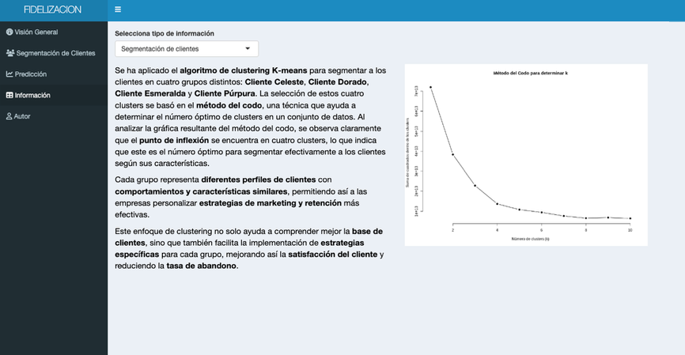

# Monitoreo de la Fidelización de Clientes en el Sector Bancario con R y Shiny

En este proyecto, he desarrollado una **aplicación** con **R** y **Shiny** para monitorizar la **fidelización de los clientes** en el **sector bancario**. La aplicación incluye varias **pestañas** que ofrecen diferentes perspectivas y análisis sobre el estado de la fidelización de los clientes.

## Visión General

En la pestaña **"Visión General"**, se presenta un **dashboard** que muestra diversos **gráficos**. Estos gráficos proporcionan información detallada sobre el estado de la fidelización de los clientes según distintos factores, como el **país**, la **edad** y la **solvencia económica**.

## Análisis de Segmentos de Clientes

La siguiente pestaña se centra en supervisar los distintos **segmentos de clientes**. Estos segmentos se han determinado mediante un **modelo de K-means**, dividiendo a los clientes en cuatro grupos: **Cliente Celeste**, **Cliente Esmeralda**, **Cliente Púrpura** y **Cliente Dorado**. La aplicación detalla las principales características de cada segmento e incluye valores y gráficos que permiten conocer el estado de fidelización de estos segmentos por separado.

## Predicción de Fidelización

En la pestaña **"Predicción"**, se utiliza un **árbol de decisión** para crear un **modelo predictivo**. Este modelo permite introducir una serie de variables y proporciona una **probabilidad** de que un cliente continúe o no con el servicio ofrecido por la empresa.

## Información del Dataset

Finalmente, en la pestaña **"Información"**, se proporciona información detallada sobre el **dataset** utilizado para este proyecto. Aquí, los usuarios pueden explorar los datos y comprender mejor las bases sobre las cuales se ha construido la aplicación.

Si quieres saber más sobre este proyecto, haz clic en el siguiente enlace que te llevará directamente al repositorio en GitHub:

[Visitar Proyecto en GitHub](https://github.com/usuario/nombre-del-proyecto)
