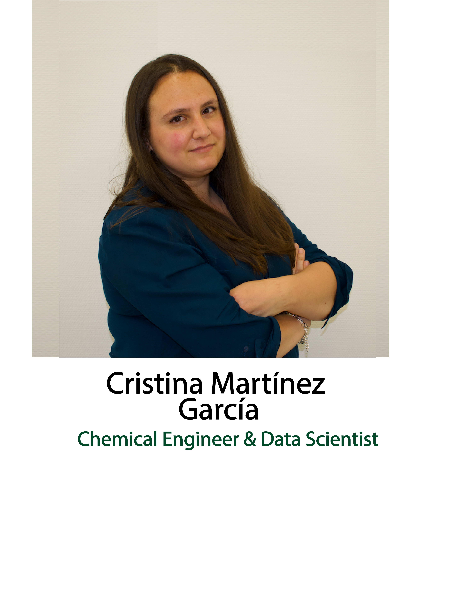

  <h2 class="post-title"> </h2>
  

 

<!-- /.tiles -->

<h1> Welcome to my page</h1>

<h6> My name is Cristina Martínez García and I have a degree in Chemical Engineering from the <a href="https://www.etsii.upm.es/" target="_blank">Higher School of Industrial Engineers</a> of the <a href="https://www.upm.es/" target="_blank">Polytechnic University of Madrid</a>. I have expanded my knowledge to become a Data Scientist and adapt to the new demands of Industry 4.0 by taking a Data course Scientist at <a href="https://www.thebridge.tech/" target="_blank">The Bridge.</a></h6>

<h6>I know the main data analysis and Machine Learning tools, and I put all my effort and motivation to improve and learn every day.  

On this page, you can find all the projects I have worked on and are currently working on.  

The projects are written in the Python programming language (Jupyter Notebook | PyCharm | Google Colab).  

Feel free to browse this page and take a look at the projects that appeal to you the most.</h6>

<!-- /.tile -->

 

