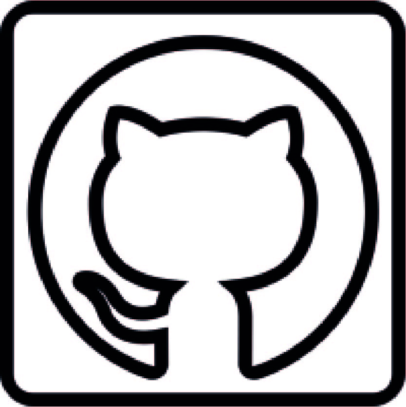

  <h2 class="post-title"> </h2>
  

  
  

Welcome!

    I am a <strong>data scientist</strong> with experience in <strong>Python</strong> and <strong>R</strong>. Here you will find a wide variety of projects ranging from <strong>brain tumour detection</strong> to <strong>image analysis</strong> to a <strong>customer loyalty prediction application</strong>.

    This portfolio is not just a collection of achievements, but a showcase of my <strong>continuous learning process</strong>. Keeping up with the <strong>latest trends</strong> and <strong>advances in machine learning</strong> is a priority for me, allowing me to constantly <strong>innovate</strong> and <strong>improve my skills</strong>. I invite you to explore my projects.

    I hope you find my work interesting and that it can inspire or help you in your own machine learning projects.
    Thank you for visiting!

