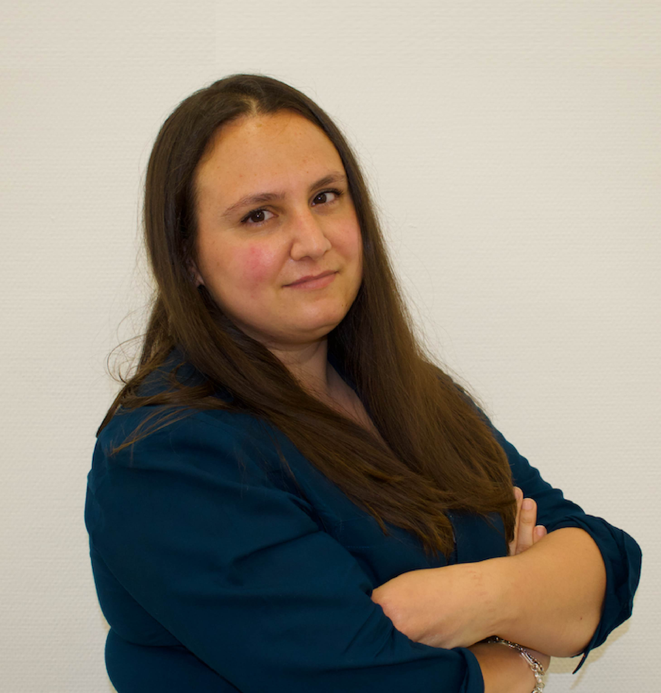

  <h2 class="post-title"> </h2>
  

<!-- /.tiles -->
  

  <h2 class="post-title">About</h2>
  

  Graduated in Chemical Engineering from the Polytechnic University of Madrid, I have expanded my knowledge to become a Data Scientist and adapt to the new requirements of Industry 4.0.  
  I know the main data analysis tools and Machine Learning, and I still want to continue learning and improving.  
  If you want to know more about me, please check my profile on <a href="https://www.linkedin.com/in/cristina-mart%C3%ADnez-garc%C3%ADa-438209170/"> Linkedin </a>.

  <a href="https://www.linkedin.com/in/cristina-mart%C3%ADnez-garc%C3%ADa-438209170/"> Linkedin </a> page for more details.

<!-- /.tile -->

  <h2 class="post-title">Location</h2>
  
We are based at the University of Western Australia. Our research team are part of the <a href="http://www.science.uwa.edu.au/schools/biological-sciences" target="_blank"> School of Biological Sciences</a> and the <a href="http://handbooks.uwa.edu.au/units?section=unitcode&faccode=60&deptcode=01470" target="_blank"> Oceans Graduate School</a>, and we are members of the <a href="http://www.oceans.uwa.edu.au" target="_blank"> Oceans Institute</a>.  We are located in the newly established <a href="http://www.oceans.uwa.edu.au/collaborations/iomrc" target="_blank"> Indian Ocean Marine Research Centre</a> on the UWA campus.

<!-- /.tile -->

               

I know the main data analysis tools and Machine Learning, and I still want to continue learning and improving.

If you want to know more about me, please check my profile on Linkedin or send me an email

